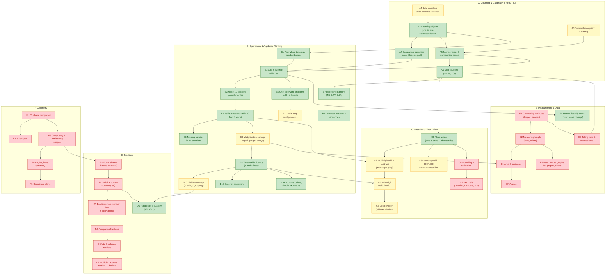

# Math Skills Map & App Coverage

A map of the math skills kids need to learn from Pre-K through 5th grade (the app's
target range), organized as a learning progression, then mapped to the exercises
currently in the app. Skill framework follows the Common Core domains, which also
align with Singapore Math / Math Mammoth style progressions.

**App difficulty levels:** L1 = Pre-K, L2 = Kindergarten, L3 = 1st grade,
L4 = 2nd–3rd grade, L5 = 4th–5th grade (see `LEVEL_DATA` in `js/settings.js`).

**Coverage legend:** ✅ covered &nbsp; 🟡 partial &nbsp; ❌ gap

---

## 1. The Skill Progression (process diagram)

Arrows show prerequisites — a child should be solid on a skill before moving to the
ones it points to. Color shows current app coverage.

### Reading the diagram by grade band

| Band | App level | Core focus |
|---|---|---|
| Pre-K | L1 | A1–A4, B7 (counting, comparing, patterns) |
| Kindergarten | L2 | A5–A6, B1–B3, E1, F1 (number bonds, +/− within 10, shapes) |
| 1st grade | L3 | B4–B6, C1, C3, E3–E4 (facts to 20, place value, time, money) |
| 2nd–3rd grade | L4 | B8–B11, C2, C4, D1–D4, E2, E5–E6 (×/÷, regrouping, fraction concepts) |
| 4th–5th grade | L5 | B12–B14, C5–C7, D5–D7, E7, F4–F5 (multi-digit ops, fractions, decimals) |

---

## 2. Current App Exercise Inventory (math)

Where exercises surface in the game:

- **Wild encounters** — clue challenges use `pickChallengeType('math')` → core math + any registry activity with a math skill at the current level (`js/encounter.js:271`)
- **Gym battles** — same challenge pool at level + gym boost (`js/battle.js`, `getChallenge` in `js/data.js`)
- **Pokemon Lab** — direct activity sessions from `ACTIVITY_REGISTRY` (`js/pokedex.js`)
- **Training Grounds** — 60-second rapid-fire math drills from the same pool (`js/training.js`)
- **Team Rocket** — number-pattern puzzles + timed math at level + 1 (`js/rocket.js`)
- **Daily Challenge** — reuses generators at +1 difficulty (`js/systems.js`)

| Exercise | Source | Levels | Skills exercised | What it actually asks |
|---|---|---|---|---|
| Counting Catch | `activities.js` `genCountingCatch` | 1–3 | A2 | Count 1–30 emoji and pick the total |
| More or Less | `genMoreOrLess` | 1–2 | A4 | Which group has more (1–30 objects) |
| Pattern Path | `genPatternPath` | 1–3 | B7 | Complete AB / ABC / AAB / ABB repeating patterns |
| Number Line Race | `genNumberLineRace` | 2–3 | A5 | Which number comes between a and b (to 100) |
| Number Bond | `genNumberBond` | 1–5 | B1 | Missing part of a part-part-whole bond (to 100) |
| Make 10 | `genMakeTen` | 2–5 | B3 | Complements to 10 / 20 / 100 |
| Missing Number | `genMissingNumber` | 2–4 | A6, C3, B13 | Fill the blank in skip-count sequences (1s, 2s, 3s, 5s, 10s, descending) |
| Place Value | `genPlaceValue` | 1–5 | C1 | Digit in tens/ones → thousands place; expanded form at L5 |
| Potion Mixer | `genPotionMixer` | 3–4 | B5 | One-step add/subtract word problems |
| Bar Model | `genBarModel` | 1–5 | B1, B5, B11 | Singapore bar-model problems: part-whole (L1–3), comparison (L4), two-step (L5) |
| Coin Counter | `genCoinCounter` | 3–5 | E4 | Count coin values: pennies → quarters → dollars |
| Times Tables | `genTimesTable` | 2–5 | B9, B6, B10 | ×/÷ fact drill incl. missing-factor and inverse-division formats |
| Multiply Power-Up | `genMultiplicationPowerup` | 4–5 | B8, B9, B6 | a × b to 12×12, missing-factor variant |
| Breeder Fractions | `genBreederFractions` | 5 | D5 | "2/3 of 12 Bulbasaur have evolved…" — fraction of a set |
| Core math questions | `data.js` `genMathQuestion` | 1–5 | A2, A4, B2, B4, B8–B10, B12, B14, C2 (no regrouping scaffold), C5/C6 (lightly) | Counting & compare (L1), +/− within 10 (L2), within 20 (L3), ×/÷ facts and 2-digit +/− (L4), multi-digit ×, ÷, order of ops, 3-digit +/−, squares (L5) |
| Rocket Number Patterns | `rocket.js` `genNumberPattern` | 1–5 | B13, A6, B14 | Continue sequences: skip counting → ×/÷ patterns → squares, cubes, triangle numbers, Fibonacci, powers, oblong numbers |
| Rocket Timed Math | `rocket.js` `renderTimedMathPuzzle` | 1–5 (+1 boost) | fluency over same skills as core math | 5 questions, ≥4 correct under time pressure |
| Code Breaker | `activities.js` `genCodeBreaker` | 5 | logic (adjacent) | Symbol-substitution decoding — logical reasoning, not arithmetic |

---

## 3. Skill-by-Skill Coverage Map

### A. Counting & Cardinality

| Skill | Status | App exercises | Notes / gap |
|---|---|---|---|
| A1 Rote counting | 🟡 | implicit in Counting Catch | Never asked to recite or order a full sequence |
| A2 Counting objects | ✅ | Counting Catch, core math L1 | Strong |
| A3 Numeral recognition & writing | 🟡 | implicit (all answers are numerals) | No "match the numeral to the quantity" or tracing/writing |
| A4 Comparing quantities | ✅ | More or Less, core math L1 ("which is bigger") | Symbolic comparison (>, <, =) never taught |
| A5 Number order / number line | ✅ | Number Line Race | Capped at L3; no ordering 3+ numbers |
| A6 Skip counting | ✅ | Missing Number, Rocket patterns | Strong |

### B. Operations & Algebraic Thinking

| Skill | Status | App exercises | Notes / gap |
|---|---|---|---|
| B1 Number bonds / part-whole | ✅ | Number Bond, Bar Model | Strong — true Singapore-style |
| B2 Add/sub within 10 | ✅ | core math L2, Number Bond, Make 10 | Strong |
| B3 Make-10 strategy | ✅ | Make 10 | Extends to 20 and 100 — strong |
| B4 Add/sub within 20 fluency | ✅ | core math L3, Training drills, Rocket timed | Timed drills give real fluency practice |
| B5 One-step word problems | ✅ | Potion Mixer, Bar Model | Strong |
| B6 Missing number in equation | ✅ | Times Tables (missing factor), Multiply Power-Up, Number Bond | Add/sub missing-addend format (e.g. `7 + ? = 12`) not explicit |
| B7 Repeating patterns | ✅ | Pattern Path | Strong |
| B8 Multiplication concept | 🟡 | core math L4 "what is 6 groups of 4", Multiply Power-Up hints | No visual arrays / equal-groups models — jumps to abstract facts |
| B9 Times-table fluency | ✅ | Times Tables, Multiply Power-Up, drills | Strong — forward, reverse, missing-factor |
| B10 Division concept | 🟡 | Times Tables reverse format, core math L4–5 | Only as inverse-of-multiplication; no sharing/grouping models, no remainders |
| B11 Multi-step word problems | 🟡 | Bar Model L5 (two-step +/−) | No multi-step problems mixing × and ÷ |
| B12 Order of operations | ✅ | core math L5 | Two-step only (a × b + c); no parentheses |
| B13 Number patterns / sequences | ✅ | Rocket patterns, Missing Number | Exceptionally strong (Fibonacci, squares, cubes, powers) |
| B14 Squares / exponents intro | ✅ | core math L5 (n²), Rocket patterns | Fine for the age range |

### C. Base Ten / Place Value

| Skill | Status | App exercises | Notes / gap |
|---|---|---|---|
| C1 Place value | ✅ | Place Value (tens/ones → thousands, expanded form) | Strong |
| C2 Multi-digit add/sub with regrouping | 🟡 | core math L4 (2-digit), L5 (3-digit) | Problems exist but multiple-choice with no regrouping scaffold; no column-addition representation |
| C3 Counting within 100/1000 | 🟡 | Missing Number, Make 10 (to 100) | Number Line Race stops at L3/100 |
| C4 Rounding & estimation | ❌ | — | Nothing. Key 3rd–4th grade skill |
| C5 Multi-digit multiplication | 🟡 | core math L5 (2-digit × 1-digit, ×10/×25/×50) | No true 2-digit × 2-digit; no algorithm scaffold |
| C6 Long division | 🟡 | core math L5 (dividends to ~150, clean only) | No remainders, ever |
| C7 Decimals | ❌ | Coin Counter shows `$1.35` notation only | No decimal place value, comparison, or arithmetic |

### D. Fractions — biggest structural gap

| Skill | Status | App exercises | Notes / gap |
|---|---|---|---|
| D1 Equal shares (halves/quarters) | ❌ | — | No visual partitioning |
| D2 Unit fractions & notation | ❌ | — | Fraction symbols appear in Breeder Fractions without ever being taught |
| D3 Number line / equivalence | ❌ | — | Core 3rd grade standard |
| D4 Comparing fractions | ❌ | — | |
| D5 Fraction of a quantity | ✅ | Breeder Fractions (1/2, 1/3, 1/4, 2/3, 3/4, 1/5, 2/5…) | Good, but it's the *last* fraction skill, taught without the prerequisites |
| D6 Add/sub fractions | ❌ | — | 4th–5th grade standard |
| D7 Multiply fractions / decimal link | ❌ | — | 5th grade standard |

### E. Measurement & Data

| Skill | Status | App exercises | Notes / gap |
|---|---|---|---|
| E1 Comparing attributes | ❌ | — | Easy Pre-K/K win (which Pokémon is taller/heavier — data is in `POKEMON_DB`) |
| E2 Measuring length | ❌ | — | |
| E3 Telling time | ❌ | — | Major 1st–3rd grade gap |
| E4 Money | ✅ | Coin Counter (pennies → dollars) | No making-change problems |
| E5 Data & graphs | ❌ | — | No picture graphs, bar charts, tables |
| E6 Area & perimeter | ❌ | — | 3rd–4th grade standard |
| E7 Volume | ❌ | — | 5th grade standard |

### F. Geometry — entirely uncovered

| Skill | Status | App exercises | Notes / gap |
|---|---|---|---|
| F1 2D shapes | ❌ | — | Nothing in the app uses shapes at all |
| F2 3D shapes | ❌ | — | |
| F3 Compose/partition shapes | ❌ | — | Also the natural on-ramp to fractions (D1) |
| F4 Angles, lines, symmetry | ❌ | — | |
| F5 Coordinate plane | ❌ | — | Could map naturally onto a town-map mini-game |

---

## 4. Summary

**Coverage by domain** (24 of 41 skills covered or partial):

| Domain | ✅ | 🟡 | ❌ |
|---|---|---|---|
| A. Counting & Cardinality | 4 | 2 | 0 |
| B. Operations & Algebraic Thinking | 10 | 3 | 0 |
| C. Base Ten | 1 | 4 | 2 |
| D. Fractions | 1 | 0 | 6 |
| E. Measurement & Data | 1 | 0 | 6 |
| F. Geometry | 0 | 0 | 5 |

**What the app does well:** number sense and operations. The arithmetic spine
(counting → bonds → make-10 → facts → times tables → multi-digit) is well covered
with both conceptual activities (Number Bond, Bar Model, Place Value) and fluency
drills (Training Grounds, Rocket timed math), plus an unusually strong
patterns/sequences strand.

**Biggest gaps, in rough priority order:**

1. **Telling time (E3)** — expected by every 1st–3rd grade curriculum; no coverage.
2. **Fraction foundations (D1–D4)** — Breeder Fractions exists at L5 with no
   conceptual ramp below it. Visual equal-shares and fraction-notation activities
   at L3–4 would fix the inversion.
3. **Geometry (F1–F3)** — entire domain missing; shape recognition is a cheap L1–L2 add.
4. **Rounding & estimation (C4)** — prerequisite for decimals and mental math.
5. **Data & graphs (E5)** — picture graphs of caught Pokémon would be a natural fit.
6. **Decimals (C7)** — needed for true 4th–5th grade coverage; Coin Counter is a
   ready-made bridge.
7. **Conceptual × and ÷ (B8, B10)** — add array/equal-groups visuals and
   remainder problems to the existing fact drills.
